#  Response to Reviewer onrA
### A.1 Evaluation on Constructed Datasets and Advanced SAE Variants
#### A.1.1 Evaluation on the Gender Pronoun Task
On the Gender Pronoun Task, we compare SCA (ours) with vanilla SAE, JumpReLU SAE, Top-K SAE, BatchTopK SAE, and the Transcoder. Due to the large fluctuations of the Top-K SAE curve, Figures 1(a) and 1(b) do not include Top-K SAE. Figures 2(a) and 2(b) include Top-K SAE. 
 
<table>
<tr>
  <td align="center">
    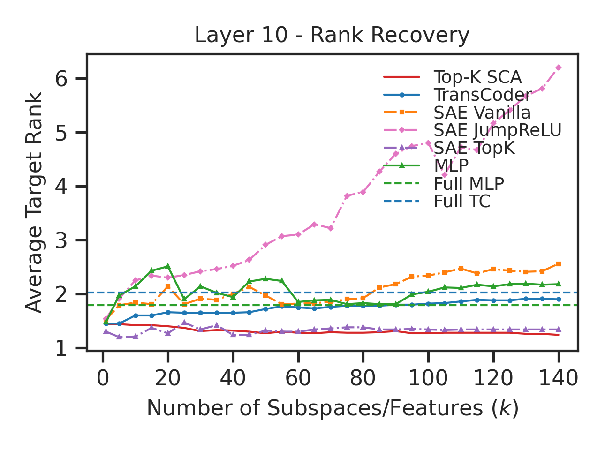 
    <b>Figure 1 (a). Rank (without Top-K SAE)</b>
  </td>
  <td align="center">
    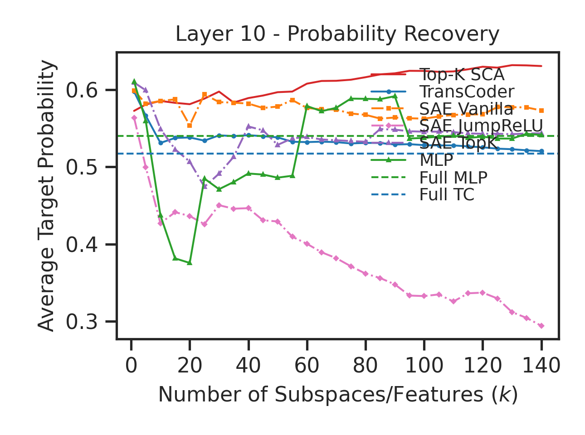 
    <b>Figure 1 (b). Probability (without Top-K SAE)</b>
  </td>
</tr>
</table>
<table>
<tr>
  <td align="center">
    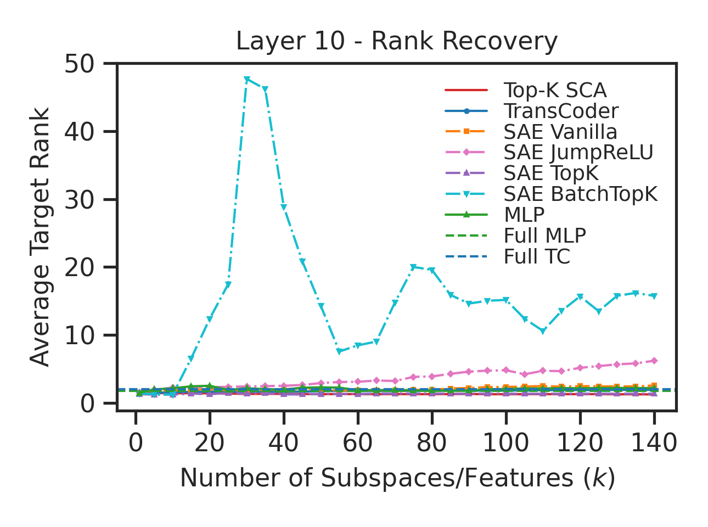 
    <b>Figure 2 (a). Rank (with Top-K SAE)</b>
  </td>
  <td align="center">
    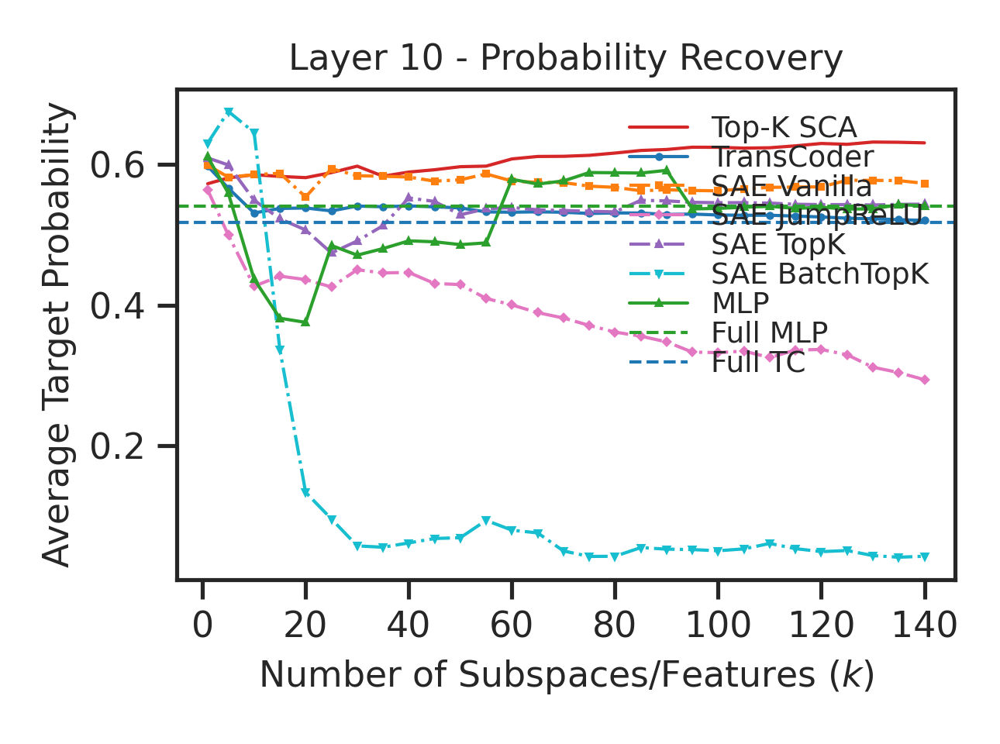 
    <b>Figure 2 (b). Probability (with Top-K SAE)</b>
  </td>
</tr>
</table>

#### 🔹 Evaluation on the Subject–Verb Agreement Task (Simple Structure)
On the Subject–Verb Agreement Task (Simple Structure), we compare SCA (ours) with vanilla SAE, JumpReLU SAE, Top-K SAE, BatchTopK SAE, and the Transcoder. Due to the large fluctuations of the Top-K SAE curve, Figures 3(a) and 3(b) do not include Top-K SAE. Figures 4(a) and 4(b) include Top-K SAE.

 
<table>
<tr>
  <td align="center">
    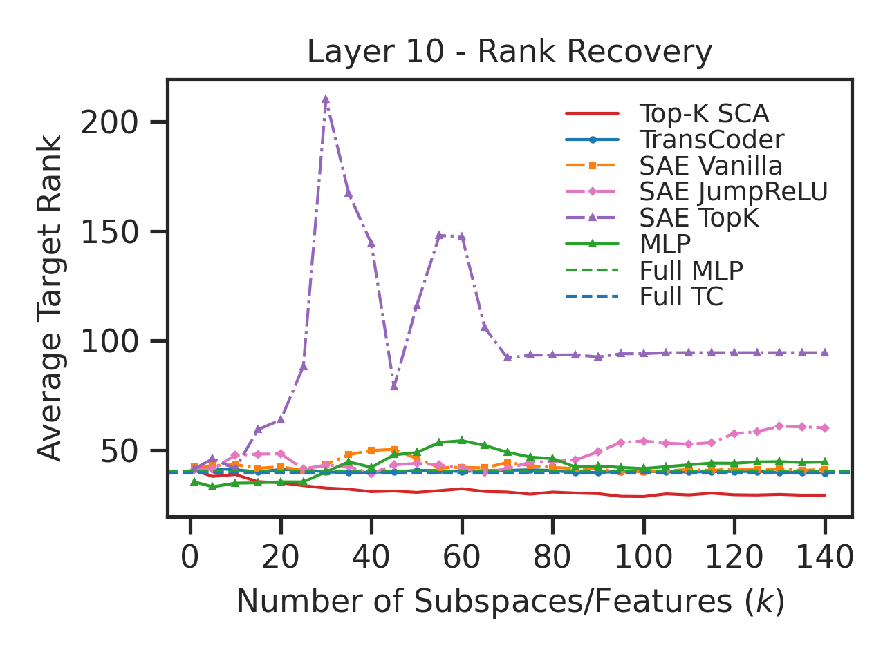 
    <b>Figure 3 (a). Rank (without Top-K SAE)</b>
  </td>
  <td align="center">
    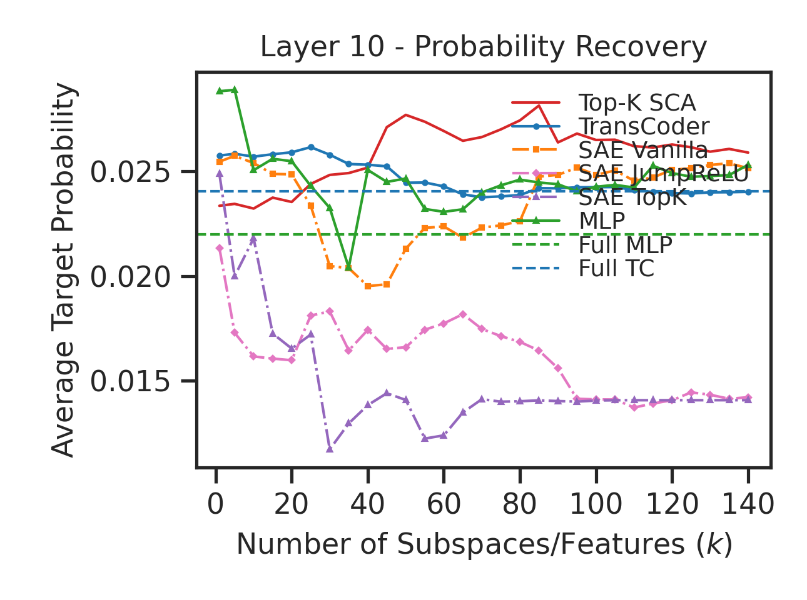 
    <b>Figure 3 (b). Probability (without Top-K SAE)</b>
  </td>
</tr>
</table>
<table>
<tr>
  <td align="center">
    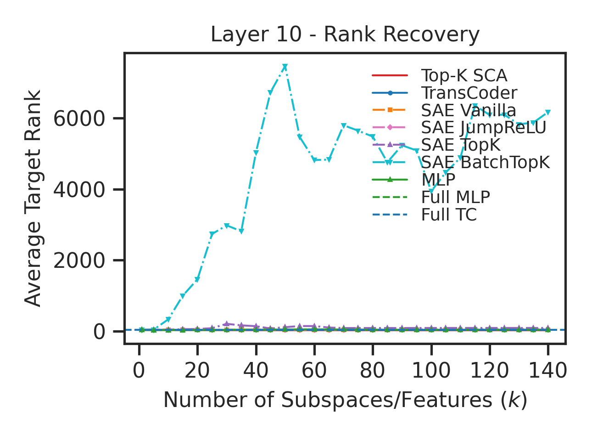 
    <b>Figure 4 (a). Rank (with Top-K SAE)</b>
  </td>
  <td align="center">
    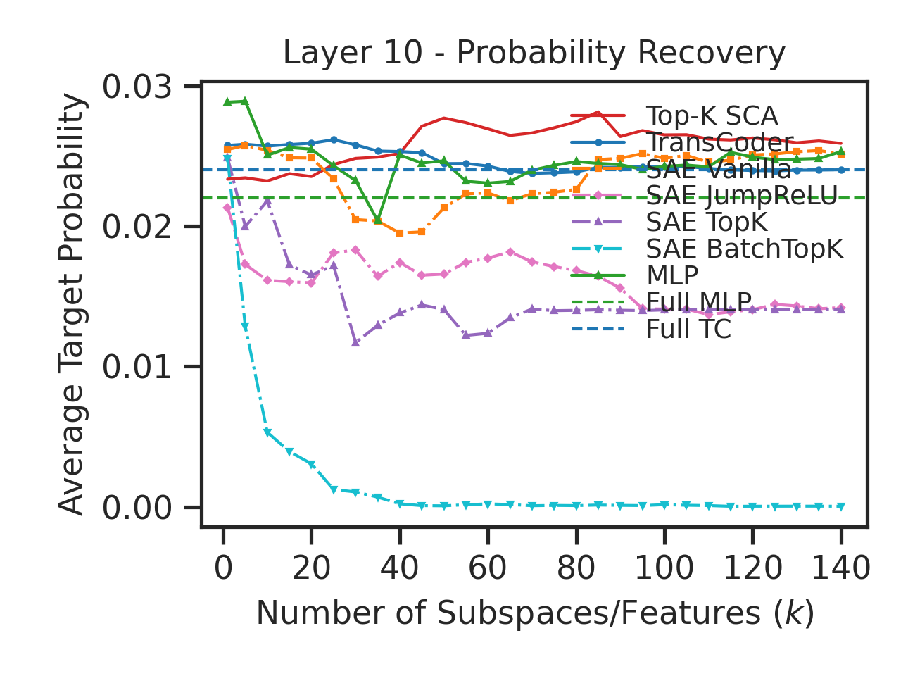 
    <b>Figure 4 (b). Probability (with Top-K SAE)</b>
  </td>
</tr>
</table>

#### 🔹 Evaluation on the Subject–Verb Agreement Task (Relative Clause) 
On the Subject–Verb Agreement Task (Relative Clause), we compare SCA (ours) with vanilla SAE, JumpReLU SAE, Top-K SAE, BatchTopK SAE, and the Transcoder. Due to the large fluctuations of the Top-K SAE curve, Figures 5(a) and 5(b) do not include Top-K SAE. Figures 6(a) and 6(b) include Top-K SAE.

 
<table>
<tr>
  <td align="center">
    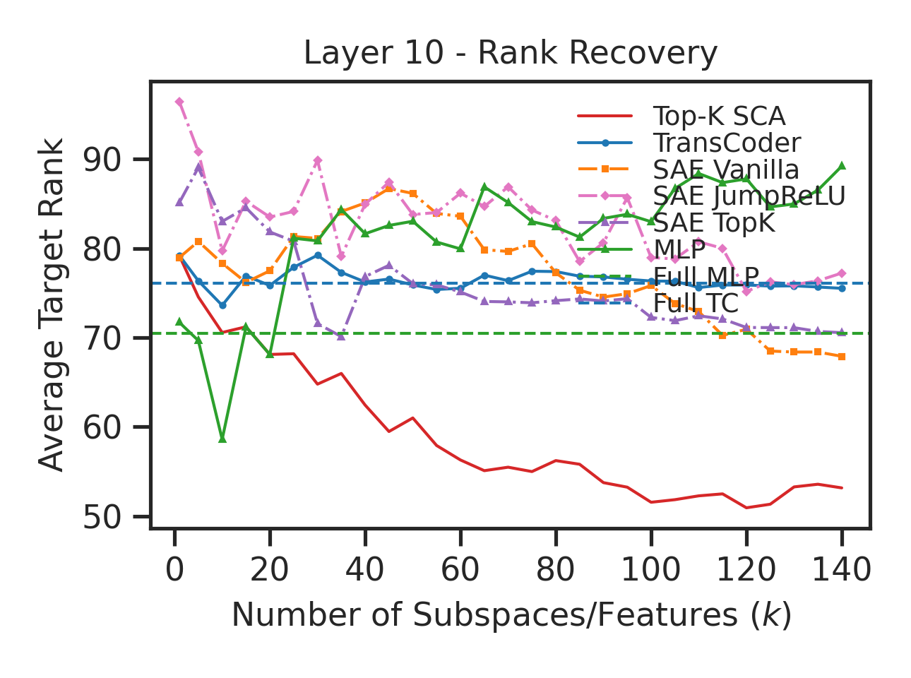 
    <b>Figure 5 (a). Rank (without Top-K SAE)</b>
  </td>
  <td align="center">
    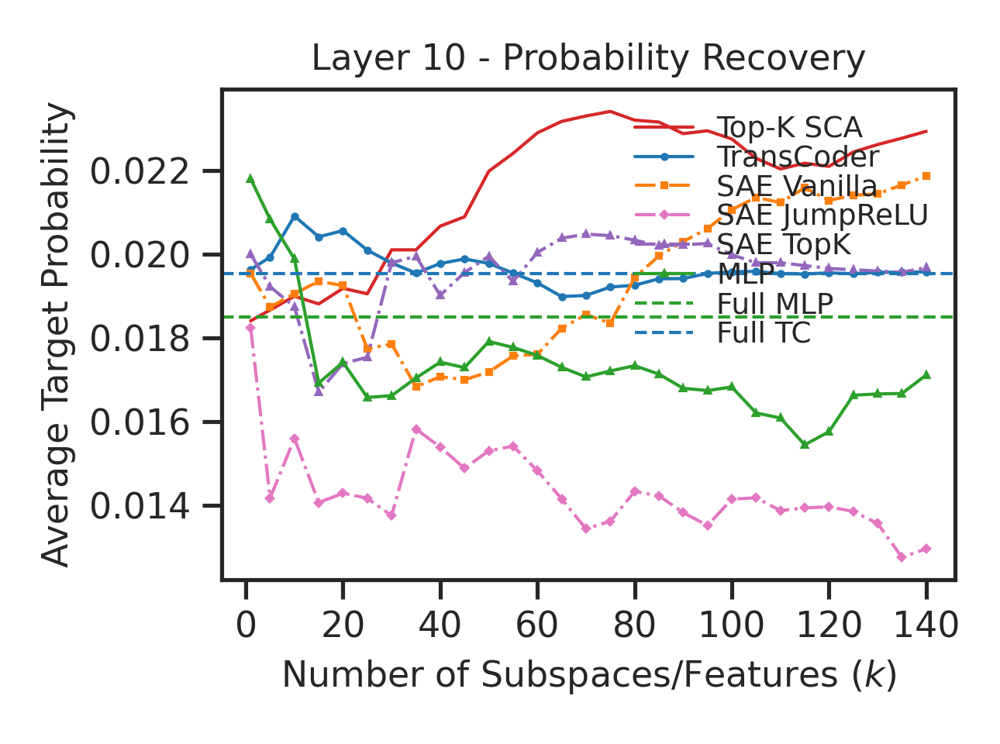 
    <b>Figure 5 (b). Probability (without Top-K SAE)</b>
  </td>
</tr>
</table>
<table>
<tr>
  <td align="center">
    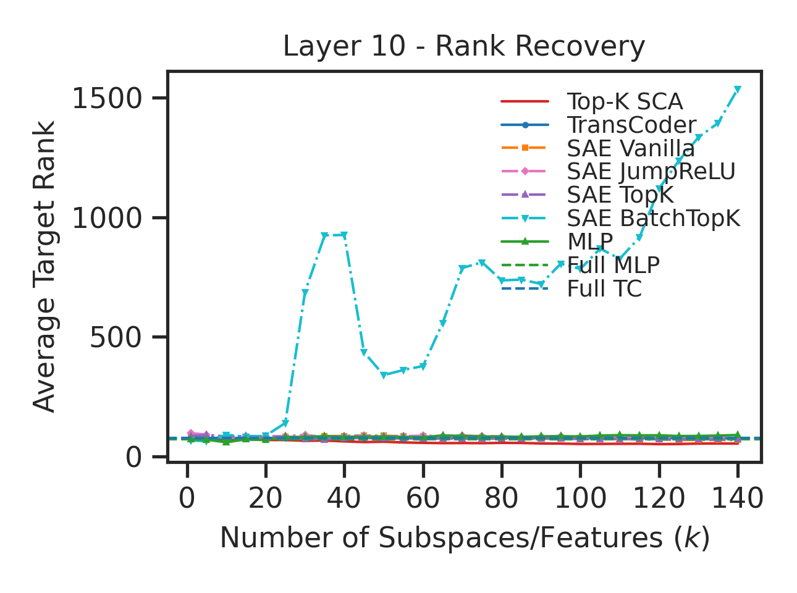 
    <b>Figure 6 (a). Rank (with Top-K SAE)</b>
  </td>
  <td align="center">
    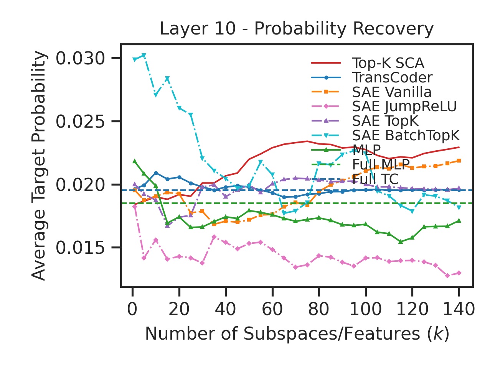 
    <b>Figure 6 (b). Probability (with Top-K SAE)</b>
  </td>
</tr>
</table>
