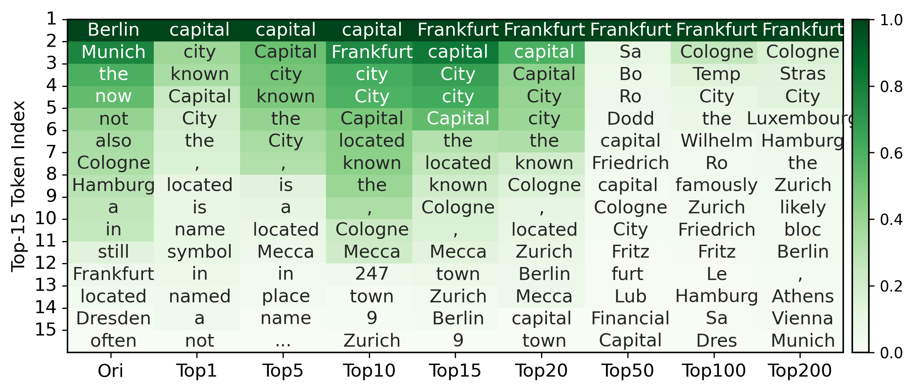
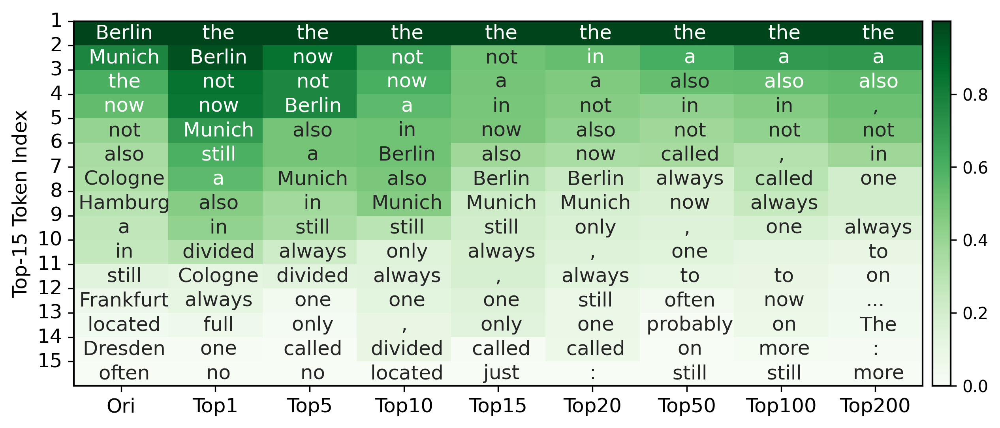
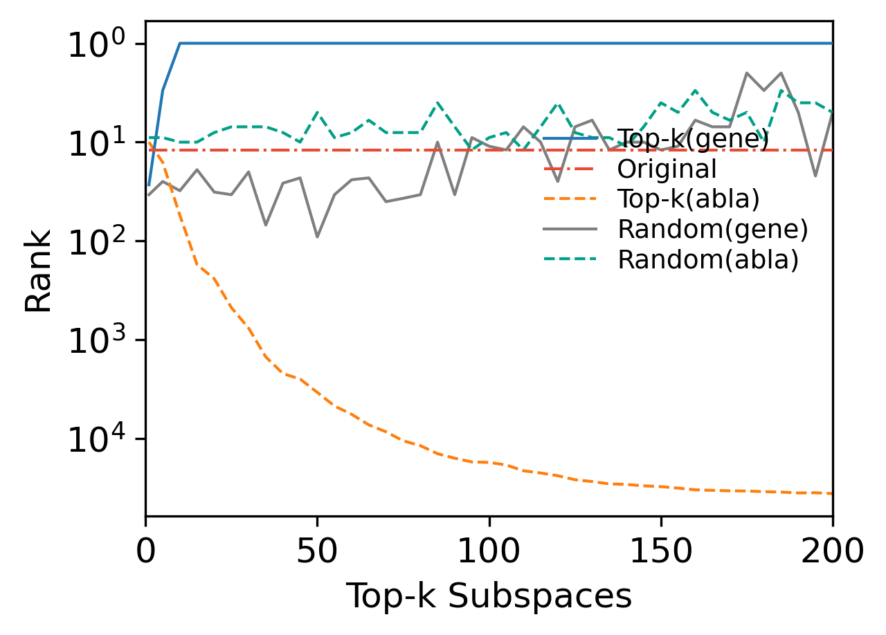
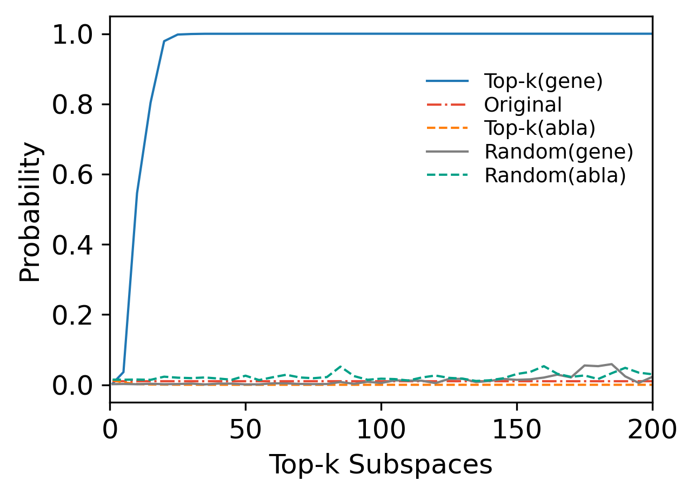
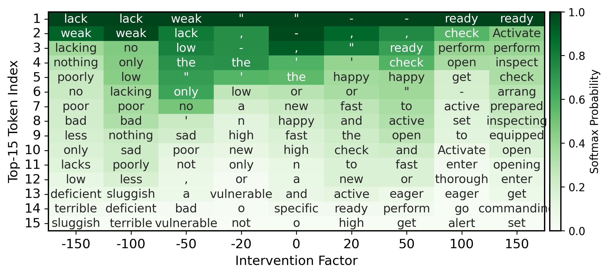
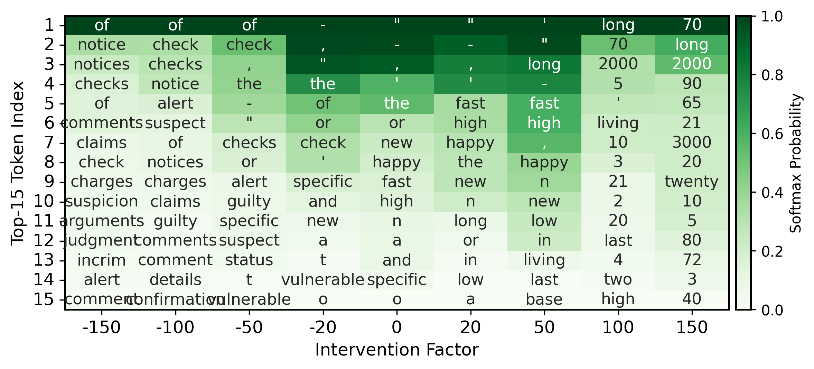

#  A. Response to Reviewer rK9R
### A.1 Causal Evidence of Pathway-Driven Predictions (When the Target Token Is Not Rank-1).
 
<table>
<tr>
  <td align="center">
     
    <b>Figure 1 (a). Standard Experiment</b>
  </td>
  <td align="center">
     
    <b>Figure 1 (b). Ablation Experiment </b>
  </td>
</tr>
</table>

**Figure 1. Reconstruction of Middle-to-Late MLP Layers via Pathways within Top-$k$ High-Contribution Subspaces: Standard vs. Ablation.**
Here, we visualize the top-15 predicted tokens of GPT2‑Medium under standard and ablation interventions for the case "*The capital of Germany is*" → "*Frankfurt*".
 

### A.2 Impact of Pathways on Predictive Performance (When the Target Token Is Not Rank-1).

<table>
<tr>
  <td align="center">
     
    <b>Figure 2 (a). Rank (↓) </b>
  </td>
  <td align="center">
     
    <b>Figure 2 (b). Probability (↑) </b>
  </td>
</tr>
</table>

**Figure 2. Pathway Analysis via Top-$k$ Subspace Interventions in GPT2-Medium.** We evaluate the impact of high-contribution subspaces on the target token’s probability ($\uparrow$) and rank ($\downarrow$) in the positive semantic case ("*The capital of Germany is*" → "*Frankfurt*").

### A.3 Subspace Interventions.

**Table 1. Semantic Interpretation and Contributions of Subspaces 5 and 9.** Here, we consider the prompt "*The cat looks very*".
 |Subspace|  Negative Direction | Positive Direction | Subspace Contribution|
 |-|-|-|-|
 | 5 | insufficiency concepts | Inspection Actions | 0.073 |
 | 9 |Criticismand Feedback | historical decades| 0.0623 |

<table>
<tr>
  <td align="center">
     
    <b>Figure 3 (a). Intervention on Subspace 5.</b>
  </td>
  <td align="center">
     
    <b>Figure 3 (b). Intervention on Subspace 9. </b>
  </td>
</tr>
</table>

**Figure 3. Model Lexical Preferences under Intervention on Subspaces 5 and 9.** We show the evolution of the top-15 tokens as the relative perturbation coefficient $\alpha$ varies from suppression ($\alpha < 0$) to amplification ($\alpha > 0$). Here, we consider the prompt "*The cat looks very*".
