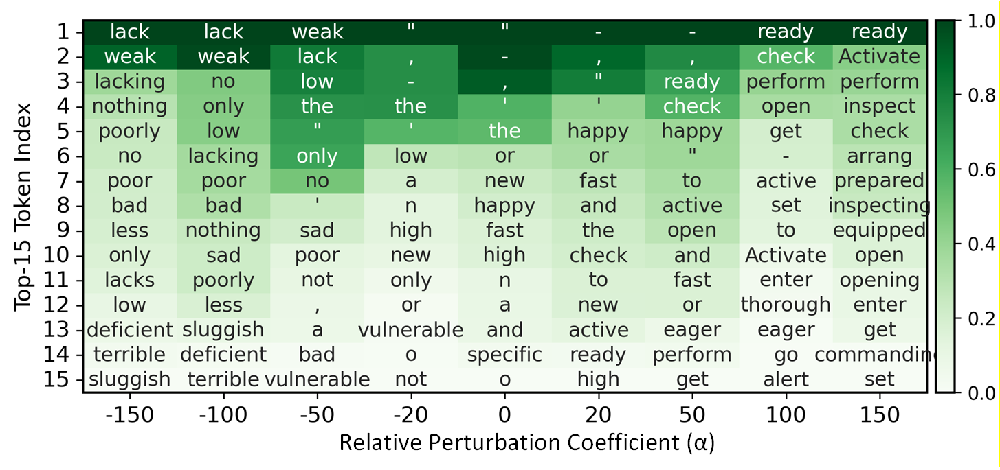
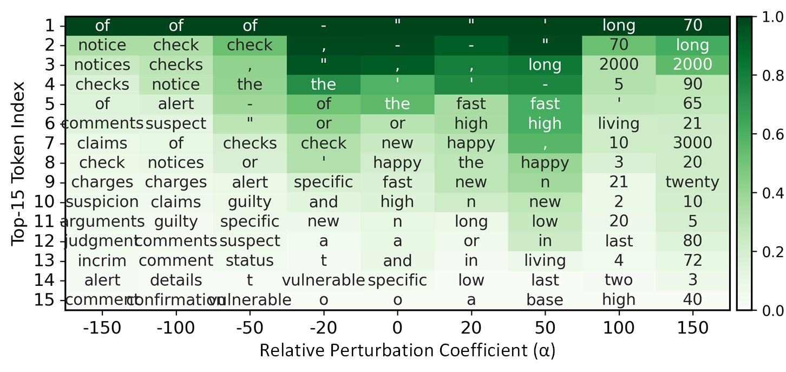

#  A. Response to Reviewer rK9R
------------------
 
<table>
<tr>
  <td align="center">
     
    <b>Figure 1 (a). Standard Experiment</b>
  </td>
  <td align="center">
     
    <b>Figure 1 (b). Ablation Experiment </b>
  </td>
</tr>
</table>

**Figure 1. Reconstruction of Middle-to-Late MLP Layers via Pathways within Top-*k* High-Contribution Subspaces: Standard vs. Ablation.**
Here, we consider the case "*The capital of Germany is*" → "*Frankfurt*".
 

------------------

<table>
<tr>
  <td align="center">
     
    <b>Figure 2 (a). Rank (↓) </b>
  </td>
  <td align="center">
     
    <b>Figure 2 (b). Probability (↑) </b>
  </td>
</tr>
</table>

**Figure 2. Pathway Analysis via Top-*k* Subspace Interventions in GPT2-Medium.** Here, we consider the case ("*The capital of Germany is*" → "*Frankfurt*").

------------------

 
<table>
<tr>
  <td align="center">
     
    <b>Figure 3 (a). Intervention on Subspace 5.</b>
  </td>
  <td align="center">
     
    <b>Figure 3 (b). Intervention on Subspace 9. </b>
  </td>
</tr>
</table>

**Figure 3. Model Lexical Preferences under Intervention on Subspaces 5 and 9.** Here, we consider the prompt "*The cat looks very*".
