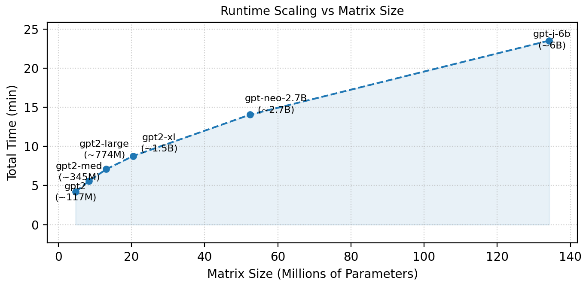
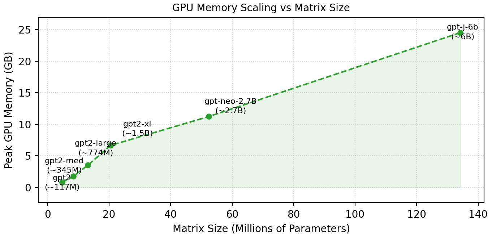

#  A. Response to Reviewer wjvF
 
---------------
**Table 1. Model Configurations and Parameter Counts**
|Model | GPT-2       | GPT2-Medium | GPT2-Large | GPT2-XL  | GPT-Neo-2.7B | GPT-J-6B |
|------------|------------|-------------|------------|----------|--------------|----------|
| Parameters| 117 million | 345 million | 774 million | 1.5 billion | 2.7 billion  | 6 billion |

 

<table>
<tr>
  <td align="center">
     
    <b>Figure 1. Runtime for Building the Interpretability Datastore for a Single Layer. </b>
  </td>
</table>

 
 <table>
<tr>
  <td align="center">
     
    <b>Figure 2. Peak GPU Memory for Building the Interpretability Datastore for a Single Layer. </b>
  </td>
</table>
